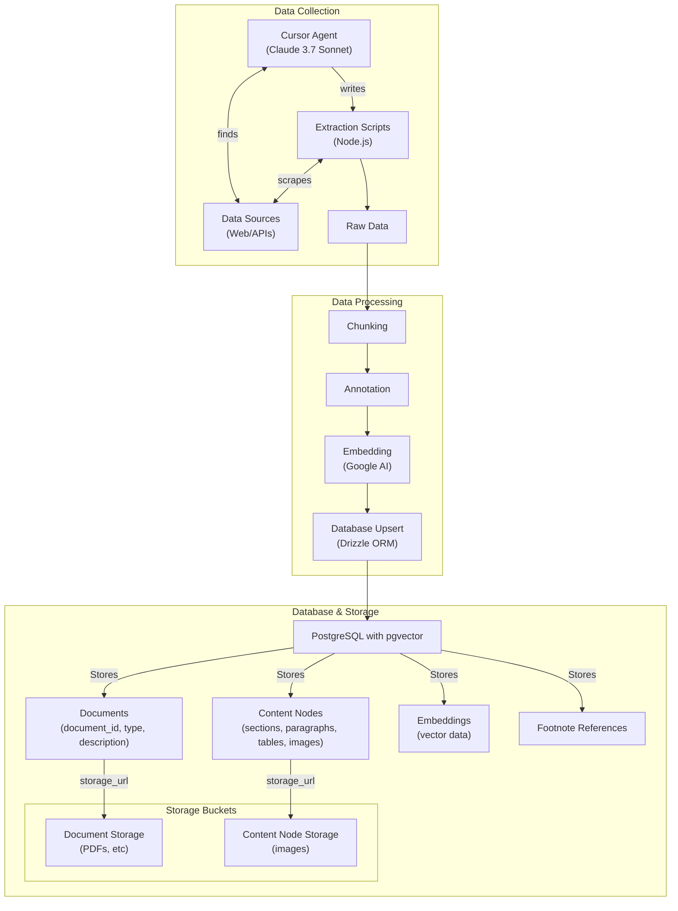
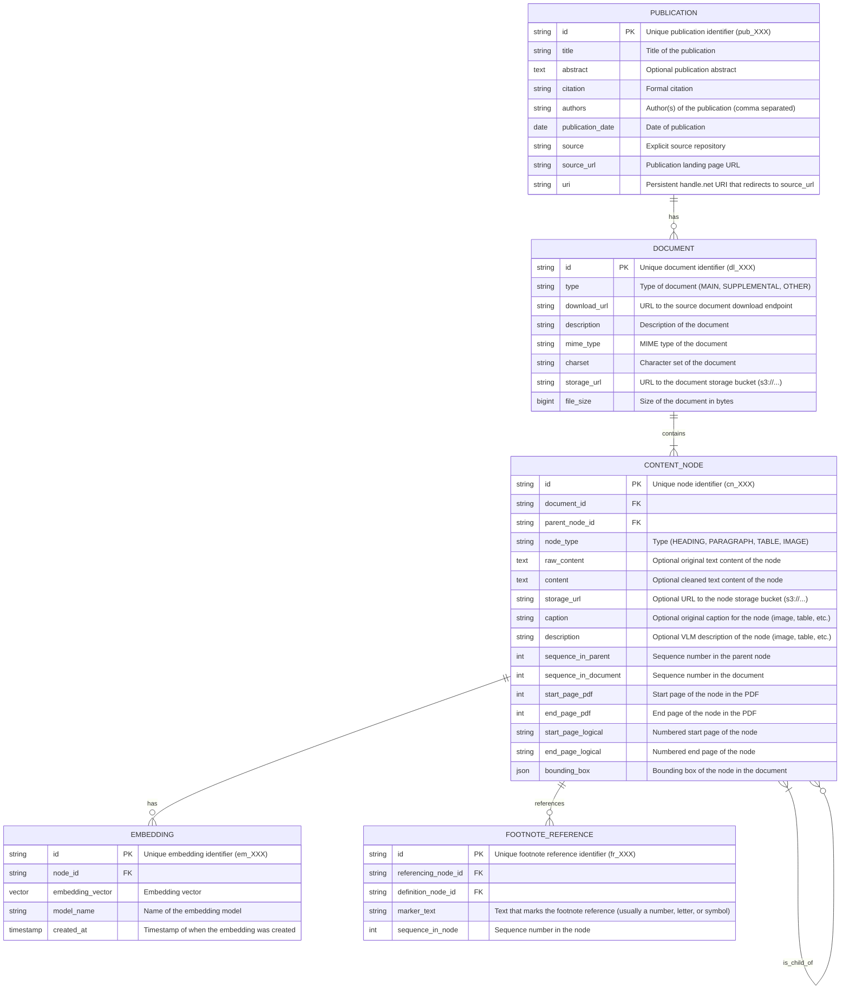

# Nature Finance RAG Database and API for working with IMF climate development reports

## Getting Started

1. Clone the repository with `git clone https://github.com/Teal-Insights/nature-finance-rag-api && cd nature-finance-rag-api`
2. Run `npm install` to install the dependencies
3. Run `docker compose up` to start the Postgres database
4. Run `npm run db:migrate` to migrate the database
5. Run `npm run ingest:pdfs` to ingest the PDFs

## Implementation

The text is chunked by line breaks, with a max chunk length of 2500 characters. This is very naive and should be improved.

## ETL architecture

## Database Schema

