# Nature Finance RAG Database and API for working with IMF climate development reports

## Getting Started

1. Clone the repository with `git clone https://github.com/Teal-Insights/nature-finance-rag-api && cd nature-finance-rag-api`
2. Run `npm install` to install the dependencies
3. Run `docker compose up` to start the Postgres database
4. Use `uv run -m module_name.script_name` to run the scripts
    - Modules are meant to be run in this order: extract -> transform -> load
    - Scripts are numbered to indicate the order they should be run in

## Synchronization with the client

This repository is the data ingestion pipeline for the [Nature Finance RAG Client](https://github.com/Teal-Insights/nature-finance-rag-client).

It's important to keep the database schema in sync with the client. You can run a comparison from the root of this repo with:

```bash
diff absolute/path/to/client/models.py load/schema.py
```

## RAG Implementation

The text is chunked by line breaks, with a max chunk length of 2500 characters. This is very naive and should be improved.

## ETL Architecture


## Database Schema

```mermaid
erDiagram
    %% Relationship lines
    PUBLICATION ||--o{ DOCUMENT : has
    DOCUMENT ||--|{ SEMANTIC_NODE : contains
    DOCUMENT ||--|{ DOCUMENT_COMPONENT : contains
    DOCUMENT_COMPONENT ||--o{ DOCUMENT_COMPONENT : "contains (self-reference)"
    DOCUMENT_COMPONENT ||--o{ SEMANTIC_NODE : contains
    SEMANTIC_NODE      ||--o{ RELATION : source_of
    SEMANTIC_NODE      ||--o{ RELATION : target_of

    %% Entity: PUBLICATION
    PUBLICATION {
        string id PK "Unique publication identifier (pub_XXX)"
        string title "Title of the publication"
        text abstract "Optional publication abstract"
        string citation "Formal citation"
        string authors "Author(s) of the publication (comma separated)"
        date publication_date "Date of publication"
        string source "Explicit source repository"
        string source_url "Publication landing page URL"
        string uri "Persistent handle.net URI that redirects to source_url"
    }

    %% ENUM: DocumentType
    DocumentType {
        string MAIN "The main document"
        string SUPPLEMENTAL "A supplemental document"
        string OTHER "Other document type"
    }

    %% ENTITY: DOCUMENT
    DOCUMENT {
        string id PK "Unique document identifier (dl_XXX)"
        string publication_id FK "FK to the PUBLICATION that contains this document"
        DocumentType type "Type of document"
        string download_url "URL to the source document download endpoint"
        string description "Description of the document"
        string mime_type "MIME type of the document"
        string charset "Character set of the document"
        string storage_url "URL to the document storage bucket (s3://...)"
        bigint file_size "Size of the document in bytes"
        string language "Language of the document"
        string version "Version of the document"
    }

    %% ENUM: ComponentType (Structural Nodes)
    ComponentType {
        string ACKNOWLEDGEMENTS
        string APPENDIX
        string BIBLIOGRAPHY
        string DEDICATION
        string FOOTER
        string FRONT_MATTER
        string HEADER
        string INDEX
        string LIST
        string NOTES_SECTION
        string TABLE_OF_BOXES
        string TABLE_OF_CONTENTS
        string TABLE_OF_FIGURES
        string TABLE_OF_TABLES
    }

    %% ENUM: SemanticNodeType (Content Nodes)
    SemanticNodeType {
        string ABSTRACT
        string BLOCK_QUOTATION
        string BIBLIOGRAPHIC_ENTRY
        string CAPTION
        string FIGURE
        string FORMULA
        string LIST_ITEM
        string NOTE
        string PARAGRAPH
        string PAGE_NUMBER
        string SUBTITLE
        string TABLE
        string TEXT_BOX
        string TITLE
    }

    %% ENTITY: DOCUMENT_COMPONENT (The Containers/Structure)
    DOCUMENT_COMPONENT {
        string id PK
        string document_id FK
        ComponentType component_type "The type of structural container"
        string title "The heading/title of this component, e.g., 'Chapter 1: Introduction'"
        string parent_component_id FK "Self-referencing FK to build the hierarchy"
        int sequence_in_parent "Order of this component within its parent"
    }

    %% ENUM: EmbeddingSource
    EmbeddingSource {
        string TEXT_CONTENT "Embed the primary text content"
        string DESCRIPTION  "Embed the AI-generated description (for tables, figures)"
        string CAPTION "Embed the original caption (for figures, tables)"
    }

    %% ENTITY: SEMANTIC_NODE
    SEMANTIC_NODE {
        string id PK
        string document_id FK
        string parent_component_id FK "FK to the DOCUMENT_COMPONENT that contains this node"
        SemanticNodeType semantic_node_type
        text content "The primary, cleaned text content of the node"
        string storage_url "For binary content like images"
        string caption "The original caption from the source (for figures, tables)"
        string description "AI-generated summary/description (for figures, tables)"
        EmbeddingSource embedding_source "Which field to use for the vector embedding"
        int sequence_in_parent_major "Order of this chunk within its parent component"
        int sequence_in_parent_minor "Zero unless the node is a footnote or sidebar, in which case it indicates reading order among these supplementary nodes"
        jsonb positional_data "[{page_pdf, page_logical, char_range_start, char_range_end, bounding_box}, ...]"
    }

    %% ENUM: RelationType (For non-hierarchical links)
    RelationType {
        string REFERENCES_NOTE "Text references a footnote or endnote"
        string REFERENCES_CITATION "Text references a bibliographic entry"
        string IS_SUPPLEMENTED_BY "A node is supplemented by another node (e.g., a sidebar or legend)"
        string CONTINUES "A node continues from a previous one (e.g., across sections)"
        string CROSS_REFERENCES "A node references another arbitrary node"
    }

    %% ENTITY: RELATION
    RELATION {
        string id PK "Unique relation identifier (rel_XXX)"
        string source_node_id FK "The origin node of the relationship"
        string target_node_id FK "The destination node of the relationship"
        RelationType relation_type
        string marker_text "Optional text for the relation, e.g., '1' for a footnote or '(Author, 2025)' for a citation"
    }

    %% ENTITY: EMBEDDING
    EMBEDDING {
        string id PK "Unique embedding identifier (em_XXX)"
        string node_id FK
        vector embedding_vector "Embedding vector"
        string model_name "Name of the embedding model"
        timestamp created_at "Timestamp of when the embedding was created"
    }

    %% ===== CSS STYLING =====
    classDef enumType fill:#ffe6e6,stroke:#ff4757
    classDef mainTable fill:#e6f3ff,stroke:#0066cc

    class DocumentComponentType,RelationType enumType
    class PUBLICATION,DOCUMENT,DOCUMENT_COMPONENT,SEMANTIC_NODE,RELATION,EMBEDDING mainTable
```

