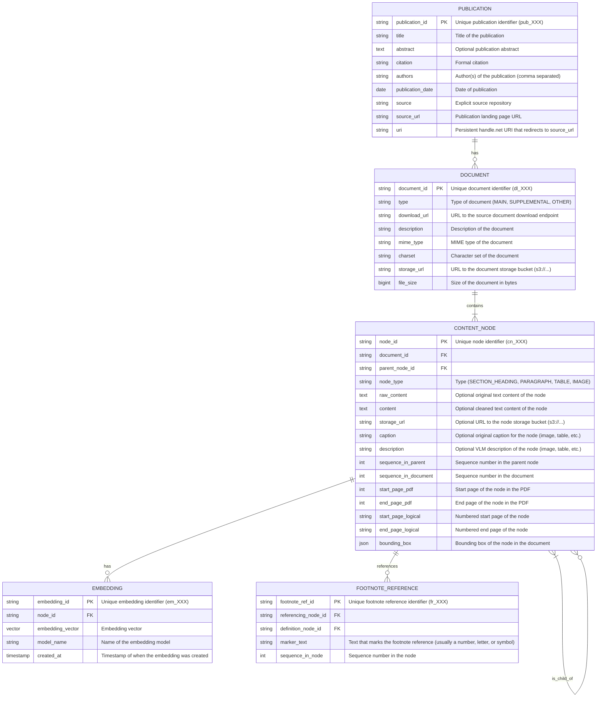

# Database Schema

To store PDF and image files, we will use AWS's "S3" storage service, which costs about $0.023 per GB per month, with no flat fee.

## JSON to Database Schema Mapping

### PUBLICATION Table
| JSON Path                     | DB Field            | Notes                              
|-------------------------------|---------------------|------------------------------------|
| `id`                          | `publication_id`    | Direct mapping                     |
| `title`                       | `title`             | Direct mapping                     |
| `abstract`                    | `abstract`          | Direct mapping                     |
| `citation`                    | `citation`          | Direct mapping                     |
| `metadata.authors`            | `authors`           | Direct mapping                     |
| `metadata.date`               | `publication_date`  | Direct mapping                     |
| `source`                      | `source`            | Direct mapping                     |
| `source_url`                  | `source_url`        | Direct mapping                     |
| `uri`                         | `uri`               | Direct mapping                     |

### DOCUMENT Table
| JSON Path                     | DB Field            | Notes                              |
|-------------------------------|---------------------|------------------------------------|
| `downloadLinks[*].id`         | `document_id`       | Direct mapping                     |
| `downloadLinks[*].url`        | `download_url`      | Direct mapping                     |
| `downloadLinks[*].file_info.mime_type` | `mime_type`| Direct mapping                     |
| `downloadLinks[*].file_info.charset`   | `charset`  | Direct mapping                     |
| `downloadLinks[*].type`       | `type`              | Direct mapping                     |
| `downloadLinks[*].text`       | `description`       | Direct mapping                     |
| -                             | `storage_url`       | To be populated during processing  |
| -                             | `file_size`         | To be populated during processing  |
