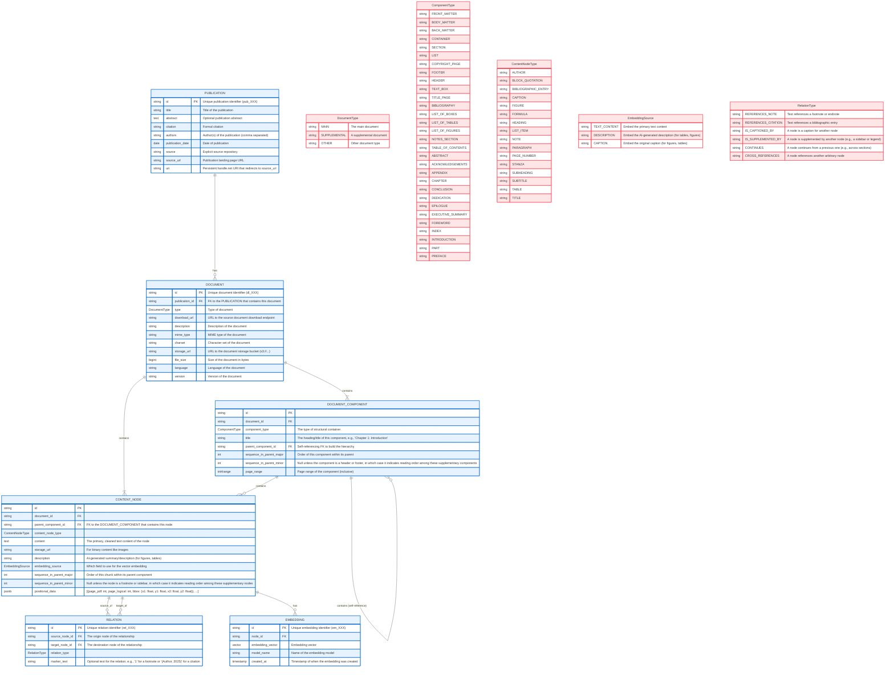

# A Graph-Based Schema for RAG

## **0. The problem**

We have basically four options, which involve some tradeoffs with regard to ingestion difficulty, queryability, and performance.

1. A single flat `content_nodes` table, where every chunk is sequentially numbered and is assigned a semantic chunk type (e.g., "paragraph", "heading") and a document section type (e.g., "front matter", "body text", "footer"), and we enrich a bit by adding heading levels for headers and decimal sequence numbers for stuff like headers and footers that isn't part of the linear reading order. Very ingestable/searchable, but requires some fancy querying work to do stuff like search within a section (which is a use case I want to support). Not a very rich representation of the document structure.

2. A flat `content_nodes` table where every record has a semantic chunk type table field and a document component type table field, but we use a supplemental `relations` table rather than sequence numbers to create a richer graph of document structure. For example, the first paragraph after a section header "continues" from the header but also "is contained by" the header. This basically enriches the flat table with hierarchical information should we want it. This somewhat mixes concerns about structure/reading order and different node types, though that's not the end of the world. More importantly, I'm not sure how headers and footers fit into a structure like this. They could perhaps have a "supplements" or "annotates" relation to other stuff on the page, or we might let the page_number field be the only relation (since the main reason to capture headers and footers is for page number mapping anyway). With this option we do lose some structural information, like the ability to have a semantic node (say, an endnote) belong to more than one document component (say, both endnote section and back matter).

3. A `content_nodes` table that contains a mixture of document component types (effectively containers that represent document structure) and semantic types (that represent discrete chunks of text/image content), where the branches are always document components and the leaves are always semantic, and we use a supplemental `relations` table to represent the relationships between nodes. A richer representation of the data, but difficult to create and inefficient/unintuitive to work with because of how it mixes contentful and non-contentful abstractions in a single nested structure and doesn't explicitly encode its constraints in the schema. We can still use `continues` and `contains` relations or filtering by enum types to functionally treat the document as flat or hierarchical, depending what we want to do.

4. Two tables, one for `content_nodes` (semantic chunks) and one for `document_components` (structural containers). Foreign keys hold hierarchical relationships, while the `relations` table holds horizontal ones. This keeps the semantic content table flat (eliminating the need to filter out non-contentful nodes for purposes of querying), and it maintains a good separation of concerns. It also enforces, within the schema itself, the constraint that the leaves are always semantic nodes that don't contain anything, while the branches are always document components. This feels to me like the cleanest option. It also lends itself to solving the ingestion problem in stages. In the first stage we can just ingest the semantic content nodes and non-hierarchical relations, and in the second stage we can enrich with document components and their relations. (Or vice versa.)

## **1. Core Philosophy**

Our design is guided by four key principles:

* **Documents as Directed Acyclic Graphs (DAGs):** Documents are not simple trees. Elements like footnotes, citations, and cross-references create a graph structure that may include one-to-many or even many-to-many relationships between children and parents and siblings. Our model embraces this complexity while maintaining an acyclic hierarchy.
* **Content Nodes as Logical Units:** A `CONTENT_NODE` represents a complete logical unit (e.g., a full paragraph, a table), irrespective of how it is physically laid out across page breaks.
* **Explicit Relationship Modeling:** Instead of overloading nodes with numerous foreign keys, a dedicated `RELATION` table defines the semantic connections (the "edges") between nodes, making the model extensible and clear.
* **Leveraging Document Ontologies for Semantic Types:** We review [existing document ontologies](https://sparontologies.github.io/doco/current/doco.html) for inspiration in constructing our own rich set of enum types. We select disjoint, content-based types rather than nested section and container types, except where the container implies its content is not part of the primary content or does not follow linear reading order. This enables powerful filtering and ranking logic without complex nesting.
* **Sequencing by Logical Reading Order:** We use the `sequence_in_document` field to order nodes by their logical reading order, which is different from the physical layout of the document.
* **Performance:** Proper database indexing on the foreign key fields (`source_node_id`, `target_node_id`) is essential and will ensure relational lookups are highly efficient.

## **3. Key Decisions**

* **Footnotes, Citations, and Markers:**
    * **Markers are Attributes, Not Nodes:** A reference marker (e.g., the superscript `¹`, in-text `[22]`, or parenthetical `(Author, 2025)`) is not its own content node. Creating a node for every marker would needlessly proliferate nodes and complicate the schema. Instead, the marker is an attribute of the relationship itself, stored in the `marker_text` field of the `RELATION` table.
    * **Multi-Hop Relationships:** The model robustly handles complex chains. For a paragraph that references a footnote that corresponds to a bibliographic entry, the graph traversal is: `[PARAGRAPH]` -> `REFERENCES_NOTE` -> `[FOOTNOTE]` -> `REFERENCES_CITATION` -> `[BIBLIOGRAPHIC_ENTRY]`.
    * **Deferred Relationship Resolution:** When sequentially processing a document, we can create a `REFERENCES_NOTE` or `REFERENCES_CITATION` relation with populated `source_node_id` and `marker_text` when we encounter a note marker, and then we can fill in `target_node_id` later when we encounter the corresponding node.

* **Positional Data and Page Breaks:**
    * We will use a dual approach:
        1.  **Metadata:** The `positional_data` JSONB array in `CONTENT_NODE` stores PDF page numbers and precise bounding boxes for each part of a node, enabling accurate UI highlighting.
        2.  **Page Break Markers:** A human-readable `[page break]` marker can be inserted into the `content` field for display and citation purposes, but should be stripped before creating embeddings.
        3.  **GIN Indexing:** We will use a GIN index on the `positional_data` JSONB array to enable efficient range queries with the `@>` operator, and a reusable plpgsql function to retrieve content nodes by page number.
        4.  **Logical Page Numbers as Both Content Nodes and Metadata:** We will create a `PAGE_NUMBER` content node for page numbers in the header or footer, and then post-ingestion we will enrich other nodes' positional data with logical page numbers by mapping the PDF page numbers to the logical page numbers.

* **Reading Order:**
    * On initial ingestion (before we have the document components), we will use `CONTINUES` relations to order the nodes by their logical reading order.
    * After ingesting the semantic nodes and creating the document components, we can traverse `CONTINUES` relations to enrich the data with `sequence_in_parent` values for faster querying.
    * Primary content related by `CONTINUES` will use integer sequence numbers, while sidebars and text boxes with `IS_SUPPLEMENTED_BY` or footnotes with `REFERENCES_NOTE` will use the sequence number of the referencing node with a minor sequence number to indicate reading order among the supplementary nodes. We can then optionally include these or not after the referencing node when linearly rendering the text in a UI.
    * I'm actually fine omitting the `HEADER` and `FOOTER` components (which cost extract to output and store) as long as we capture the logical page numbers in the content nodes. But if we do capture them, they will primarily be children of `FRONT_MATTER`, `BODY_MATTER`, and `BACK_MATTER` components (though they can also be children of other components if those components are paginated independently). A header or footer will take the major sequence number of the nearest sibling and a minor sequence number indicating the order of appearance in the parent.
    * We will sequence endnotes, chapter notes, and bibliographic entries at their original positions in the document, on the theory that the author or publisher has already decided the best place for them.
    * We could probably discard the `CONTINUES` relations after we have the document components, since they will be redundant with the `sequence_in_parent` field, and Gemini says DFS is more performant for linearly rendering the document than finding the first node and then following the linked list. (We could run a benchmark to confirm this.)

* **Markdown Formatting:**
    * I'm a bit torn on how to handle markdown formatting, particularly bold, italic, and header text. I *think* it might be optimal to leave headings unformatted, and then use the hierarchy of document components at runtime to add the appropriate formatting. That way we don't make mistakes in adding such formatting during ingestion, and if we edit the document component graph, we don't also have to edit the markdown. We could perhaps use a Postgres function to add the appropriate formatting to markdown headings based on the component hierarchy. 
    * This gets a bit dicey in that it adds a lot of complexity to the ingestion process and the component hierarchy, but it makes things easier at query time. I will have to prep some sample data using both approaches to see what's actually feasible for ingestion.
    * We can definitely hardcode the markdown formatting for any other bold or italic text in the markdown that isn't just part of a heading style. 

## **4. Unlocking Advanced RAG Capabilities**

This schema is explicitly designed to enable more intelligent RAG:

* **Content-Aware Chunking:** Chunks are logical `CONTENT_NODE`s (a paragraph, a table) rather than arbitrary character-count blocks.
* **Smarter Embeddings:** We will embed the rich text `description` for tables and figures, which is more semantically meaningful than embedding their raw structure or image data.
* **Precision Retrieval (Pre-filtering):** The `content_node_type` allows queries to be filtered *before* the vector search (e.g., "search only within nodes of type `TABLE`") for faster queries and more targeted results.
* **Contextual Re-ranking and Graph Retrieval:** After an initial vector search, an LLM can use relationships or metadata to re-rank results or retrieve related nodes.

## **5. JSON to Database Schema Mapping**

### PUBLICATION Table
| JSON Path                     | DB Field            | Notes                              
|-------------------------------|---------------------|------------------------------------|
| `id`                          | `id`    | Direct mapping                     |
| `title`                       | `title`             | Direct mapping                     |
| `abstract`                    | `abstract`          | Direct mapping                     |
| `citation`                    | `citation`          | Direct mapping                     |
| `metadata.authors`            | `authors`           | Direct mapping                     |
| `metadata.date`               | `publication_date`  | Direct mapping                     |
| `source`                      | `source`            | Direct mapping                     |
| `source_url`                  | `source_url`        | Direct mapping                     |
| `uri`                         | `uri`               | Direct mapping                     |

### DOCUMENT Table
| JSON Path                     | DB Field            | Notes                              |
|-------------------------------|---------------------|------------------------------------|
| `downloadLinks[*].id`         | `id`       | Direct mapping                     |
| `downloadLinks[*].url`        | `download_url`      | Direct mapping                     |
| `downloadLinks[*].file_info.mime_type` | `mime_type`| Direct mapping                     |
| `downloadLinks[*].file_info.charset`   | `charset`  | Direct mapping                     |
| `downloadLinks[*].type`       | `type`              | Direct mapping                     |
| `downloadLinks[*].text`       | `description`       | Direct mapping                     |
| -                             | `storage_url`       | To be populated during processing  |
| -                             | `file_size`         | To be populated during processing  |
