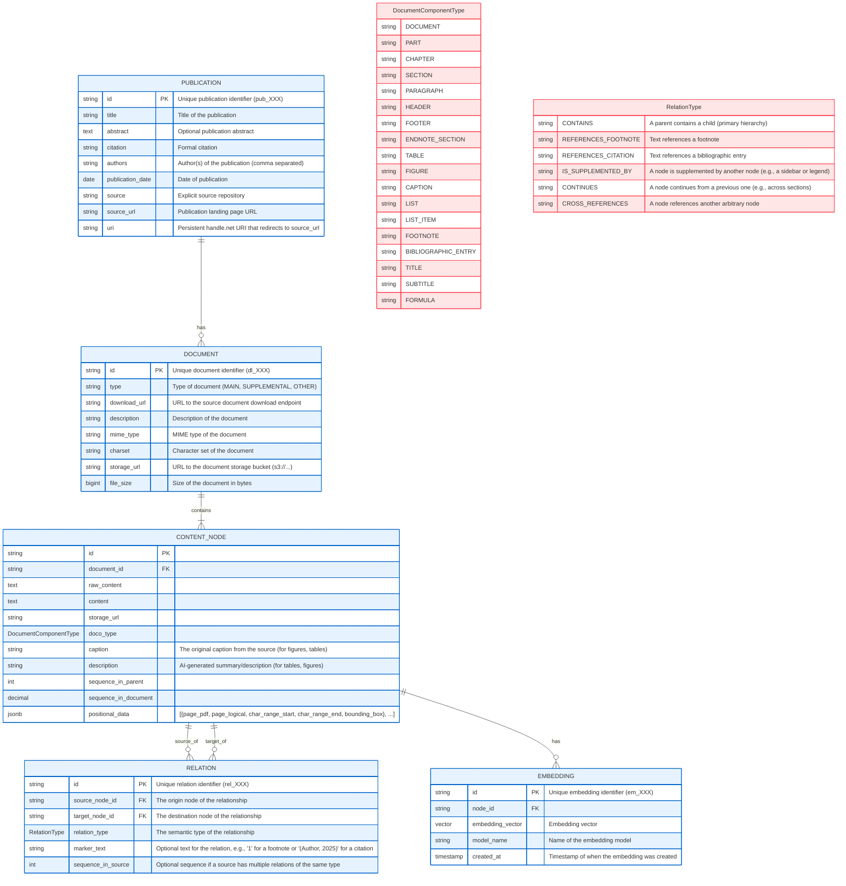

# A Graph-Based Schema for RAG

## **1. Core Philosophy**

Our design is guided by four key principles:

* **Documents as Directed Acyclic Graphs (DAGs):** Documents are not simple trees. Elements like footnotes, citations, and cross-references create a graph structure that may include one-to-many or even many-to-many relationships between children and parents. Our model embraces this complexity while maintaining an acyclic hierarchy.
* **Content Nodes as Logical Units:** A `CONTENT_NODE` represents a complete logical unit (e.g., a full paragraph, a table), irrespective of how it is physically laid out across page breaks.
* **Explicit Relationship Modeling:** Instead of overloading nodes with numerous foreign keys, a dedicated `RELATION` table defines the semantic connections (the "edges") between nodes, making the model extensible and clear.
* **Leveraging DoCo for Semantic Types:** We use the Document Components Ontology (DoCo) as inspiration for a rich set of enum types, enabling powerful filtering and ranking logic and providing a model for thinking about headers and footers as containers.
* **Page Numbers as Positional Information:** Page numbers are important to determine the position of a node in the document to enable precise "go to source" highlighting, but they are not content nodes or part of the logical hierarchy.
* **Sequencing by Logical Reading Order:** We use the `sequence_in_document` field to order nodes by their logical reading order, which is different from the physical layout of the document.
* **Performance:** Proper database indexing on the foreign key fields (`source_node_id`, `target_node_id`) is essential and will ensure relational lookups are highly efficient.

### **3. Key Decisions**

* **Footnotes, Citations, and Markers:**
    * **Markers are Attributes, Not Nodes:** A reference marker (e.g., the superscript `¹`, in-text `[22]`, or parenthetical `(Author, 2025)`) is not its own content node. Creating a node for every marker would needlessly proliferate nodes. Instead, the marker is an attribute of the relationship itself, stored in the `marker_text` field of the `RELATION` table.
    * **Multi-Hop Relationships:** The model robustly handles complex chains. For a paragraph that references a footnote that corresponds to a bibliographic entry, the graph traversal is: `[PARAGRAPH]` -> `REFERENCES_FOOTNOTE` -> `[FOOTNOTE]` -> `REFERENCES_CITATION` -> `[BIBLIOGRAPHIC_ENTRY]`.
    * **Deferred Relationship Resolution:** When sequentially processing a document, we can create a `REFERENCES_FOOTNOTE` or `REFERENCES_CITATION` relation with populated `source_node_id` and `marker_text` when we encounter a note marker, and then we can fill in `target_node_id` later when we encounter the corresponding node.

* **Positional Data and Page Breaks:**
    * We will use a dual approach:
        1.  **Metadata:** The `positional_data` JSONB array in `CONTENT_NODE` stores precise page numbers and bounding boxes for each part of a node, enabling accurate UI highlighting.
        2.  **Content:** A human-readable `[page break]` marker can be inserted into the `content` field for display and citation purposes, but should be stripped before creating embeddings.
        3.  **GIN Indexing:** We will use a GIN index on the `positional_data` JSONB array to enable efficient range queries with the `@>` operator, and a reusable plpgsql function to retrieve content nodes by page number.

* **Sequencing for Reading Order:**
    * When sequencing for reading order, we will leave chapter notes and end notes in their own sections, but we will insert footnotes after the referencing paragraph and sidebars and figures wherever seems most natural.
    * The `sequence_in_document` field will use a decimal system to number inserted nodes so that sequential numbering is preserved if we should choose to omit these during document rendering.
    * The `CONTINUES` relation type will skip over inserted nodes, which will use other relation types to connect to the primary content.

### **4. Unlocking Advanced RAG Capabilities**

This schema is explicitly designed to enable more intelligent RAG:

* **Content-Aware Chunking:** Chunks are logical `CONTENT_NODE`s (a paragraph, a table) rather than arbitrary character-count blocks.
* **Smarter Embeddings:** We will embed the rich text `description` for tables and figures, which is more semantically meaningful than embedding their raw structure or image data.
* **Precision Retrieval (Pre-filtering):** The `doco_type` allows queries to be filtered *before* the vector search (e.g., "search only within nodes of type `TABLE`") for faster queries and more targeted results.
* **Contextual Re-ranking and Graph Retrieval:** After an initial vector search, an LLM can use relationships or metadata to re-rank results or retrieve related nodes.

## JSON to Database Schema Mapping

### PUBLICATION Table
| JSON Path                     | DB Field            | Notes                              
|-------------------------------|---------------------|------------------------------------|
| `id`                          | `id`    | Direct mapping                     |
| `title`                       | `title`             | Direct mapping                     |
| `abstract`                    | `abstract`          | Direct mapping                     |
| `citation`                    | `citation`          | Direct mapping                     |
| `metadata.authors`            | `authors`           | Direct mapping                     |
| `metadata.date`               | `publication_date`  | Direct mapping                     |
| `source`                      | `source`            | Direct mapping                     |
| `source_url`                  | `source_url`        | Direct mapping                     |
| `uri`                         | `uri`               | Direct mapping                     |

### DOCUMENT Table
| JSON Path                     | DB Field            | Notes                              |
|-------------------------------|---------------------|------------------------------------|
| `downloadLinks[*].id`         | `id`       | Direct mapping                     |
| `downloadLinks[*].url`        | `download_url`      | Direct mapping                     |
| `downloadLinks[*].file_info.mime_type` | `mime_type`| Direct mapping                     |
| `downloadLinks[*].file_info.charset`   | `charset`  | Direct mapping                     |
| `downloadLinks[*].type`       | `type`              | Direct mapping                     |
| `downloadLinks[*].text`       | `description`       | Direct mapping                     |
| -                             | `storage_url`       | To be populated during processing  |
| -                             | `file_size`         | To be populated during processing  |
